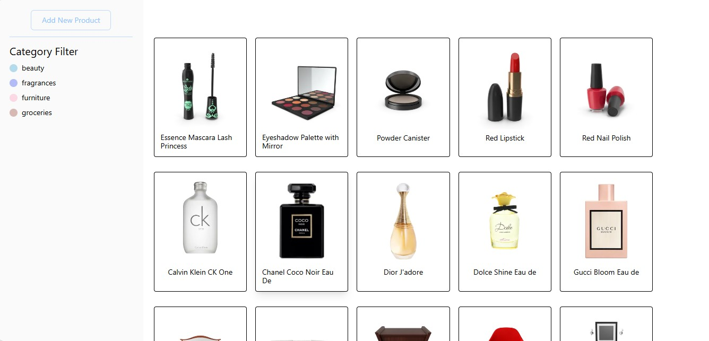
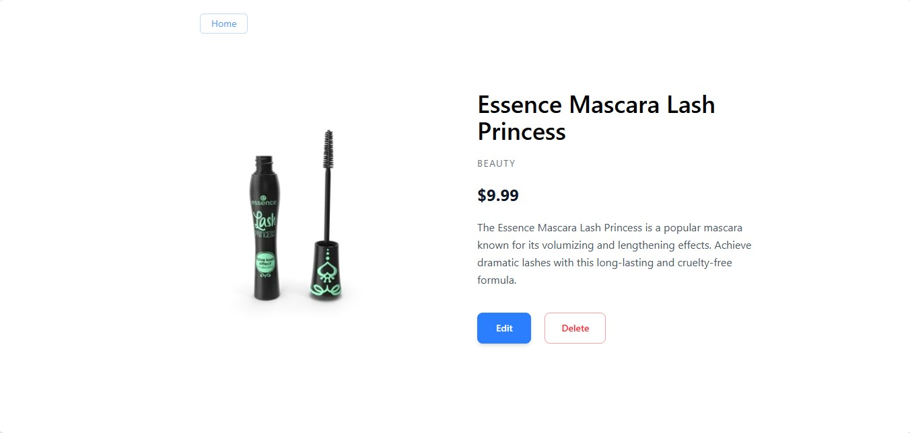
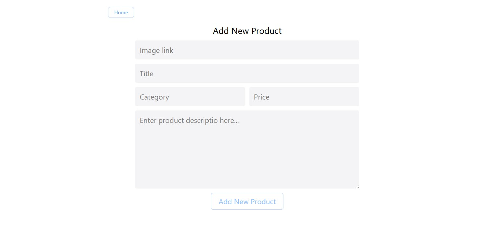
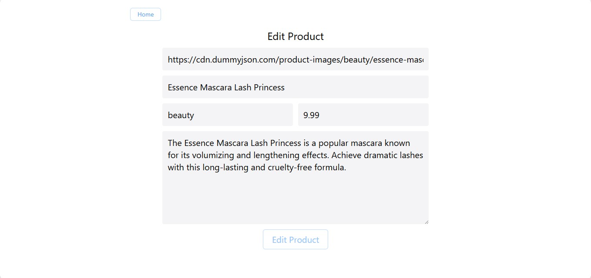

# React Product Store

This is a modern React Product Store application built using React, Tailwind CSS and Context API.  
The project focuses on CRUD operations, product management, category filtering, local storage persistence and clean UI design.

## Features

- Product Listing Page
- Product Details Page
- Add New Products
- Edit Existing Products
- Delete Products
- Category Based Filtering
- LocalStorage Data Persistence
- React Router Navigation
- Toast Notifications
- Dynamic Product Rendering
- Clean and Minimal UI Design
- Context API State Management

## Technologies Used

- React
- React Router DOM
- Tailwind CSS
- Context API
- Axios
- React Toastify
- Nanoid
- Vite
- Git & GitHub

## Folder Structure

```bash
react-product-store/
├── public/
│
├── src/
│   ├── assets/
│   │   └── screenshots/
│   │       ├── add-product.jpg
│   │       ├── edit-product.jpg
│   │       ├── home-page.jpg
│   │       └── product-details.jpg
│   │
│   ├── components/
│   │   ├── Create.jsx
│   │   ├── Details.jsx
│   │   ├── Edit.jsx
│   │   ├── Home.jsx
│   │   ├── Loader.jsx
│   │   └── Navbar.jsx
│   │
│   ├── utils/
│   │   ├── axios.jsx
│   │   └── Context.jsx
│   │
│   ├── App.jsx
│   ├── index.css
│   └── main.jsx
│
├── .gitignore
├── eslint.config.js
├── index.html
├── package-lock.json
├── package.json
├── README.md
└── vite.config.js
```

## Screenshots

### Home Page



### Product Details Page



### Add Product Page



### Edit Product Page



## Live Demo

Check it out here:

https://kenil948.github.io/react-product-store/

## How to Run

### 1. Clone the repository

```bash
git clone https://github.com/kenil948/react-product-store.git
```

### 2. Navigate to the project folder

```bash
cd react-product-store
```

### 3. Install dependencies

```bash
npm install
```

### 4. Start development server

```bash
npm run dev
```

## What I Learned

- React Fundamentals
- Context API State Management
- CRUD Operations in React
- React Router Navigation
- Tailwind CSS Styling
- Dynamic Data Rendering
- LocalStorage Data Persistence
- Reusable Component Structure
- Product Filtering Logic
- Better React Project Structuring
- Managing Application State
- Building Multi Page React Applications

## Notes

This is a frontend practice project created for learning and improving React development skills.

The project uses DummyJSON API for initial product data and LocalStorage for data persistence.
